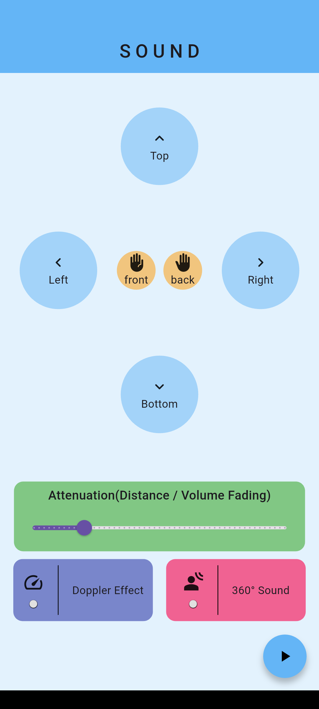
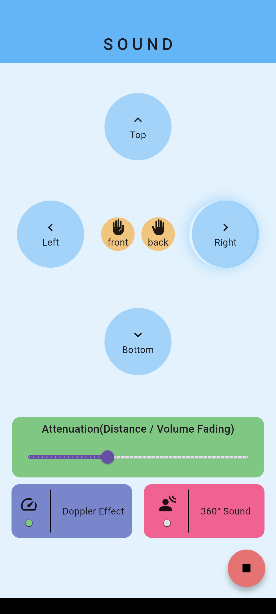

# 🎧 Sound_Space

A Flutter-based 3D audio simulation app built using **flutter_soloud** that lets users interact with sound in a virtual space.  
Move audio around, control **distance attenuation**, experience **360° sound movement**, and explore a **Doppler effect simulation** through an interactive interface.

---

## 🚀 Features
- 🎯 Directional **Spatial Audio** controls
- 🔉 **Distance Attenuation** (volume fading based on sound distance)
- 🌍 **360° Orbiting Sound** simulation
- ⚡ **Doppler Effect** (experimental / subtle implementation)
- 🎛️ Real-time sound positioning controls
- 🎨 Interactive and clean Flutter UI
- 🔄 Live sound updates with Provider state management

---

## 📂 Project Structure
```bash
lib/
├── main.dart                    # Entry point
├── screens/
│   └── home_screen.dart         # Main UI screen
├── provider/
│   └── audio_provider.dart      # Audio logic & state management
├── widgets/
│   ├── circular_button.dart     # Direction control buttons
│   ├── rectangular_button.dart  # Feature toggle buttons
│   └── custom_snackbar.dart     # Snackbar widget
assets/
├── sound/
│   └── naruto_afternoon.mp3     # Audio asset
├── screenshots/                 # App screenshots
```

---

## 📸 Screenshots

| Home Screen | 360° Sound & Controls |
|-------------|-----------------------|
|  |  |

---

## 🛠️ Built With
- [Flutter](https://flutter.dev/) – Framework  
- [Dart](https://dart.dev/) – Language  
- [flutter_soloud](https://pub.dev/packages/flutter_soloud) – 3D Audio Engine  
- [Provider](https://pub.dev/packages/provider) – State Management  

---

## 📦 How to Run
1. Clone this repo:
   ```bash
   git clone https://github.com/your-username/sound_space.git
